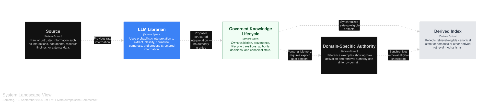
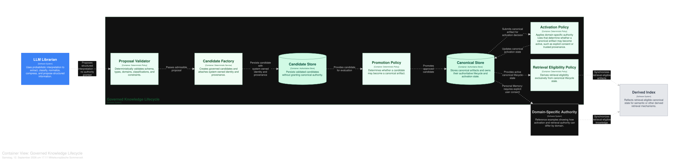
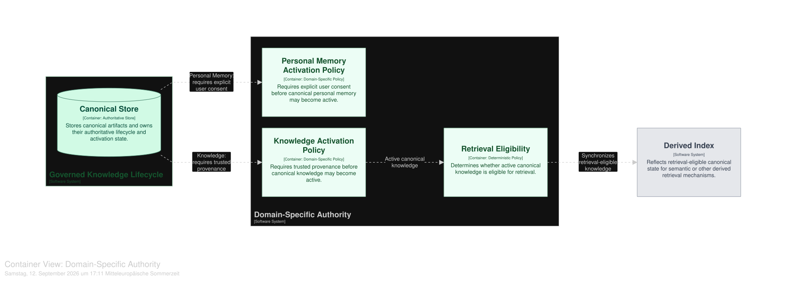

# The Librarian Pattern

**A governance pattern for separating probabilistic interpretation from authoritative state change in AI systems.**

Large language models are useful for extracting, classifying, normalizing, and compressing information. They are much less suitable as the authority that decides what becomes persistent truth, active system state, or retrievable knowledge.

The Librarian Pattern introduces an explicit boundary between those responsibilities:

> **Probabilistic systems may propose meaning. Deterministic systems decide authority.**

An LLM produces structured proposals. Deterministic validation, lifecycle rules, provenance, and explicit policies decide what may become a governed candidate, canonical state, active state, or retrieval-eligible state.

---

## Why this pattern exists

A common AI architecture shortcut looks roughly like this:

```python
memory = llm.extract(text)

if memory.confidence > 0.9:
    database.save(memory)
```

This is convenient, but it collapses several fundamentally different decisions:

- Did the model produce structurally admissible output?
- Where did the information actually come from?
- May the information enter governed candidate state?
- May it become canonical?
- May canonical information become active?
- May active information participate in retrieval?

A model-generated confidence score cannot answer all of these questions.

The Librarian Pattern separates them.

---

## Core idea

The lifecycle is conceptually:

```text
Raw / Untrusted Source
        │
        ▼
   LLM Librarian
        │
        ▼
      Proposal
        │
        │  TRUST & AUTHORITY BOUNDARY
        ▼
Deterministic Validation
        │
        ▼
 Candidate Factory
        │
        ▼
     Candidate
        │
        ▼
 Promotion Policy
        │
        ▼
Canonical Artifact
        │
        ▼
 Activation Policy
        │
        ▼
  Active Artifact
        │
        ▼
Retrieval Eligibility
        │
        ▼
   Derived Index
```

Not every implementation requires every state shown above.

The important property is the separation of authorities.

> **The Librarian proposes meaning. The system owns provenance. Policy owns authority. The index reflects canonical state.**

---

## Architecture

### Librarian Pattern Overview



The overview shows the fundamental separation between probabilistic interpretation and governed state.

The Librarian may interpret source material and propose structured information. It does not directly modify authoritative state.

### Governed Knowledge Lifecycle



The trust and authority boundary lies between probabilistic proposal generation and deterministic proposal validation.

A proposal crossing this boundary receives no authority merely because it is structured, plausible, or accompanied by high model confidence.

Only deterministic system logic may admit it into governed candidate state.

### Domain-Specific Authority



Activation and retrieval rules may differ by domain.

The diagram uses two illustrative reference domains:

- **Personal Memory** — activation requires explicit user consent.
- **Knowledge** — activation requires trusted provenance.

These domains are examples, not mandatory parts of the pattern.

An implementation may define entirely different authority policies depending on its domain and risk model.

---

## Six invariants

### 1. Proposal is not Candidate

Model output must cross deterministic validation before entering governed candidate state.

A structured LLM response is still only a proposal.

### 2. Candidate is not Truth

Persisting a candidate does not make it canonical.

Candidate state exists specifically so information can be governed before becoming authoritative.

### 3. Provenance is System-Owned

The model may describe information, but it may not manufacture its own authority or provenance.

Identifiers such as source references, pipeline identity, extraction runs, lifecycle state, and verification state belong to the system.

> **Provenance describes how the system obtained an artifact, not what the model claims about its origin.**

### 4. Promotion is not Activation

Becoming canonical does not automatically grant operational use.

Activation is a separate authority decision and may depend on domain-specific requirements such as explicit consent, trusted provenance, approval, or verification.

### 5. Confidence is not Authority

Model confidence may be an input to deterministic policy.

It is not authority by itself.

A proposal with `confidence = 0.99` may still be rejected because it violates system-owned validation or authority rules.

### 6. Index is not Truth

Vector databases, search indexes, caches, and other derived retrieval structures are not authoritative stores.

They consume canonical lifecycle state.

They do not create it.

> **The canonical store owns state. The index reflects it.**

---

## Authority ownership

The pattern deliberately distinguishes model-owned interpretation from system-owned authority.

A Librarian proposal may contain information such as:

```text
content
proposed_domain
proposed_type
tags
confidence
importance
sensitivity classification
```

System-owned information may include:

```text
candidate_id
artifact_id
source_reference
pipeline_type
extraction_run_id
timestamps
lifecycle_status
verification_status
activation_state
retrieval_eligibility
```

The exact fields are implementation-specific.

The ownership boundary is not.

---

## Reference implementation

The `demo/` directory contains a deliberately small Python reference implementation.

It does not require an LLM API, vector database, persistence framework, or agent framework.

A deterministic `MockLibrarian` represents the probabilistic interpretation step so the lifecycle can be executed and tested without external dependencies.

The demo contains three scenarios.

### Personal Memory

```text
Proposal
→ deterministic validation
→ Candidate
→ promotion
→ Canonical
→ inactive
→ explicit consent
→ Active
```

This demonstrates that **promotion is not activation**.

### Knowledge

```text
Proposal
→ deterministic validation
→ Candidate
→ promotion
→ Canonical
→ trusted provenance
→ Active
→ retrieval eligible
→ Derived Index
```

The demo subsequently deactivates the canonical artifact. The corresponding entry is then removed from the derived index.

This demonstrates that the **index follows canonical state rather than defining it**.

### Invalid Proposal

```text
Proposal
→ deterministic validation
→ REJECTED
```

The example deliberately assigns very high model confidence to an unsupported domain.

The proposal is still rejected and never becomes a Candidate.

This demonstrates that **confidence does not grant authority**.

---

## Run the demo

The reference implementation requires Python 3.11 or newer.

From the repository root:

```bash
python3 -m venv .venv
source .venv/bin/activate

python -m pip install -e ./demo
python demo/run_demo.py
```

No API key or external AI service is required.

---

## Run the tests

After installing the demo:

```bash
python -m pytest demo/tests -q
```

The tests exercise the authority boundaries and lifecycle invariants demonstrated by the reference implementation.

---

## Repository structure

```text
librarian-pattern/
├── architecture/
│   ├── workspace.dsl
│   └── workspace.json
│
├── demo/
│   ├── librarian_pattern/
│   │   ├── __init__.py
│   │   ├── index.py
│   │   ├── librarian.py
│   │   ├── lifecycle.py
│   │   ├── models.py
│   │   ├── policies.py
│   │   └── validation.py
│   │
│   ├── tests/
│   │   └── test_librarian_pattern.py
│   │
│   ├── pyproject.toml
│   └── run_demo.py
│
├── diagrams/
│   ├── librarian-pattern-overview.svg
│   ├── governed-knowledge-lifecycle.svg
│   └── domain-specific-authority.svg
│
└── README.md
```

The architecture diagrams are defined using Structurizr DSL.

---

## What this pattern does not prescribe

The Librarian Pattern does not require:

- a specific LLM
- a specific confidence threshold
- a specific database
- a vector database
- a specific embedding model
- RAG
- an agent framework
- a multi-agent architecture
- specific knowledge or memory domains
- a particular consent mechanism

Those are implementation choices.

The pattern concerns the separation between **probabilistic interpretation and authoritative state change**.

---

## Design implications

The pattern intentionally introduces more lifecycle structure than directly persisting model output.

That additional structure becomes useful when AI-generated information can influence future system behavior.

It provides explicit locations for:

- deterministic validation
- provenance
- auditability
- promotion rules
- domain-specific activation
- retrieval eligibility
- synchronization of derived state

The central design principle remains simple:

> **Candidate ≠ Canonical Truth**  
> **Structured Output ≠ Validated Output**  
> **Confidence ≠ Authority**  
> **Promotion ≠ Activation**  
> **Active ≠ Retrievable**

Derived indexes and retrieval systems consume authority.

They do not create it.